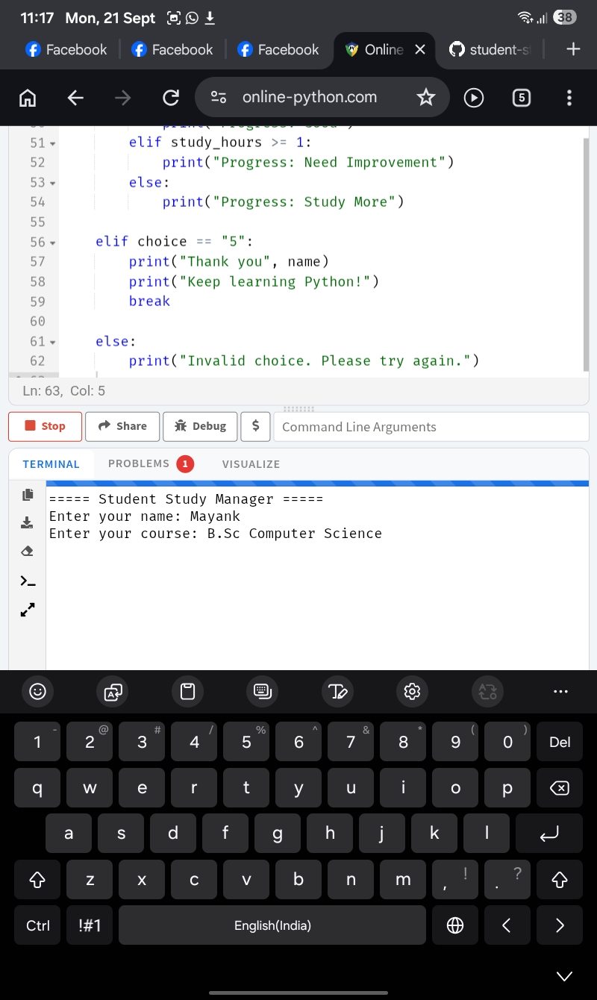
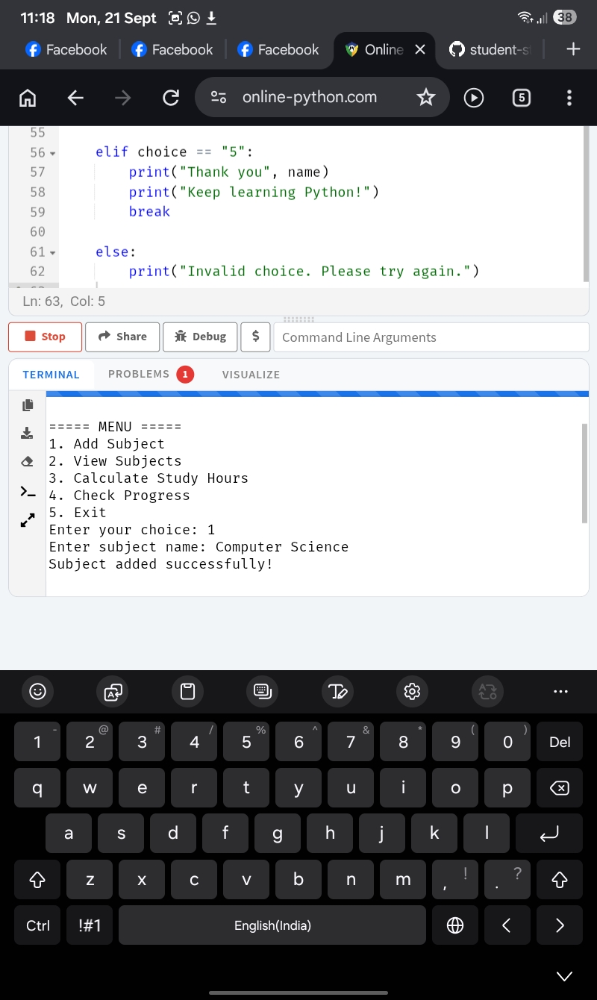
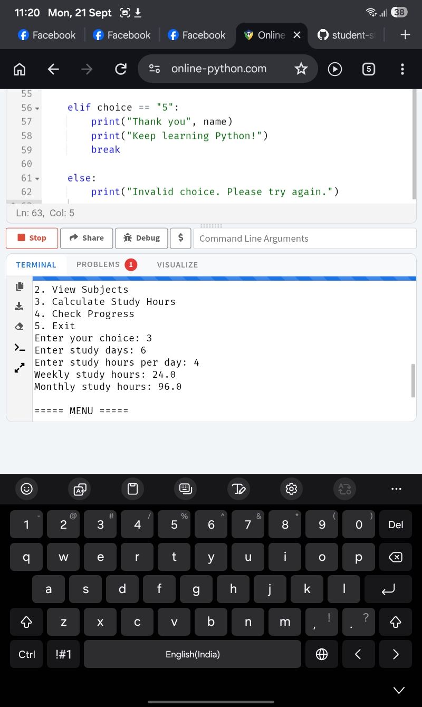
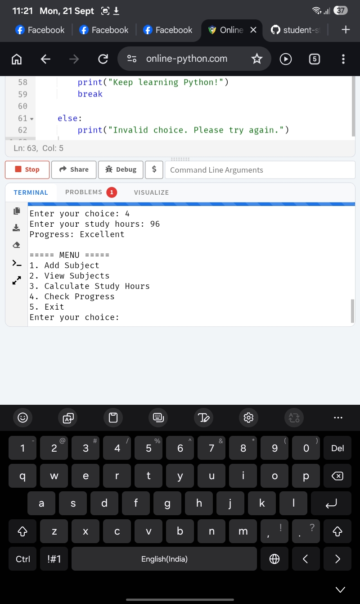
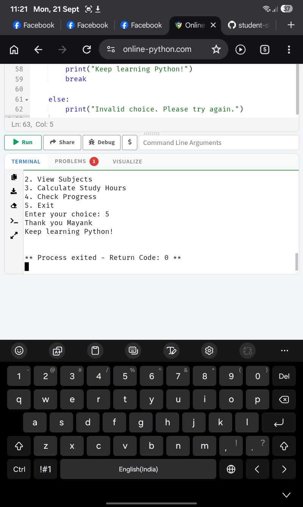

# Student Study Manager

A beginner-friendly Python project for managing study subjects and tracking study progress.
## Project Demo

This project demonstrates a simple menu-based study management system built with Python.

### What the program can do

- Add and manage study subjects
- View sorted subjects
- Calculate weekly and monthly study hours
- Check study progress
- Exit safely through a menu-driven system
## Features

- Add study subjects
- View and sort subjects
- Calculate weekly study hours
- Calculate monthly study hours
- Check study progress
- Simple menu-based system

## Technologies Used

- Python
- Variables
- Input and Output
- If-Else Conditions
- While Loop
- Functions
- Lists
- List Methods
- For Loop

## What I Learned

This project helped me practice Python programming concepts by building a simple real-world study management system.

## Project Status

Beginner Learning Project — continuously improving.

## Author

**Mayank Jaywant**

B.Sc. Computer Science Student  
Aspiring Software Developer

## Screenshots

### 1. Start Program

### 2. Add Subject

### 3. View Subjects

### 4. Calculate Study Hours

### 5. Check Progress

### 6. Exit Program

